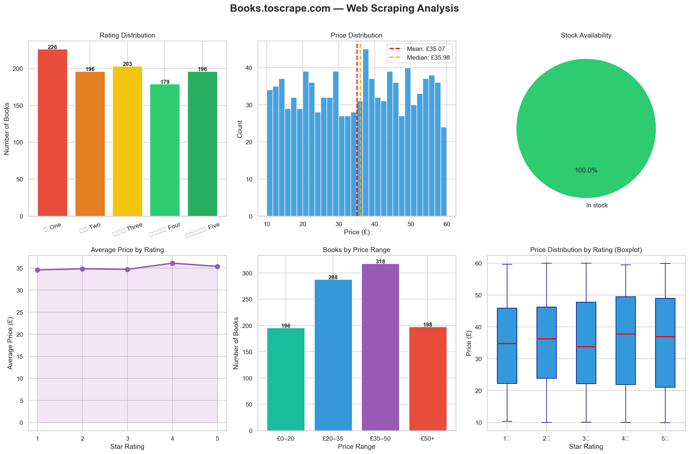

# 📚 Books.toscrape.com – Web Scraping & Data Analysis

## CodeAlpha Data Analytics Internship – Task 1

This project demonstrates the application of **Web Scraping, Data Cleaning, Exploratory Data Analysis (EDA), and Data Visualization** using Python. Data was collected from the Books to Scrape website and transformed into a structured dataset for analytical insights.


## 📌 Project Overview

The objective of this project is to extract book information from the Books to Scrape website, perform data preprocessing, analyze trends within the dataset, and present findings through professional visualizations.

The project combines web scraping techniques with data analytics workflows to showcase the complete data collection and analysis pipeline.


## 🎯 Project Objectives

* Scrape book information from the website using Python.
* Extract and organize approximately 1,000 book records.
* Clean and structure the collected data using Pandas.
* Perform exploratory data analysis (EDA).
* Generate meaningful visualizations and insights.
* Export the processed dataset and dashboard automatically.


## 📊 Dataset Information

The dataset contains information about books available on the Books to Scrape website.

Features Collected

| Feature      | Description          |
| ------------ | -------------------- |
| title        | Book title           |
| price        | Price of the book    |
| rating       | Numerical rating     |
| rating_label | Star rating category |
| availability | Availability status  |
| in_stock     | Stock indicator      |


## 🔍 Analysis Performed

The project includes:

* Data Collection using Web Scraping
* Data Cleaning and Transformation
* Descriptive Statistical Analysis
* Price Analysis
* Rating Distribution Analysis
* Availability Analysis
* Correlation Analysis
* Data Visualization


## 📈 Dashboard Visualizations

The generated dashboard (`books_scraping.png`) contains:

| Visualization            | Purpose                                 |
| ------------------------ | --------------------------------------- |
| Price Distribution       | Distribution of book prices             |
| Rating Distribution      | Frequency of ratings                    |
| Rating vs Price Analysis | Relationship between ratings and prices |
| Availability Statistics  | Stock availability analysis             |
| Correlation Analysis     | Numerical feature relationships         |
| Summary Insights         | Key analytical findings                 |


## 🔑 Key Findings

## 📌 Price Analysis

* Average Book Price: **£35.07**
* Median Book Price: **£35.98**
* Prices are distributed relatively uniformly across the catalog.

## ⭐ Rating Analysis

* Ratings are distributed across all star categories.
* No significant concentration in a single rating group.

## 📦 Stock Availability

* Nearly all listed books were marked as **In Stock** during data collection.

## 🔗 Correlation Analysis

The analysis indicates that book price and rating have a very weak relationship.

**Correlation Coefficient (r):**

r ≈ 0.02

This suggests that higher-rated books are not necessarily more expensive.


## 🛠 Technologies Used

* Python
* Requests
* BeautifulSoup4
* Pandas
* NumPy
* Matplotlib
* Seaborn


## ⚙️ Installation

Install Required Libraries

```bash
pip install requests beautifulsoup4 pandas numpy matplotlib seaborn
```


## ▶️ How to Run

Execute the script:

```bash
python books_web_scraping.py
```

The script will automatically:

1. Scrape book information from the website.
2. Store the extracted data in CSV format.
3. Perform exploratory data analysis.
4. Generate visualizations.
5. Save the dashboard as `books_scraping.png`.


## 📁 Project Structure

```text
CodeAlpha_Web_Scraping/
│
├── books_web_scraping.py
├── books_data.csv
├── books_scraping.png
└── README.md
```


## 🖼 Output

### Analytical Dashboard




## 🚀 Future Enhancements

* Scrape additional book metadata such as categories and descriptions.
* Perform sentiment analysis on book descriptions.
* Develop an interactive dashboard using Streamlit.
* Automate periodic data collection and reporting.


## 👨‍💻 Author

**Sunil Pavan Raja**

Bachelor of Technology (Artificial Intelligence and Data Science)

Prathyusha Engineering College

GitHub: https://github.com/pavansunil75

E-mail id: pavansunil75@gmail.com


## 🙏 Acknowledgements

* CodeAlpha for providing the Data Analytics Internship opportunity.
* Books to Scrape for providing a practice platform for web scraping projects.
* Open-source Python libraries that enabled data collection and analysis.


## 📄 License

This project is intended for educational and internship purposes.


⭐ If you found this project useful, consider giving it a star.
